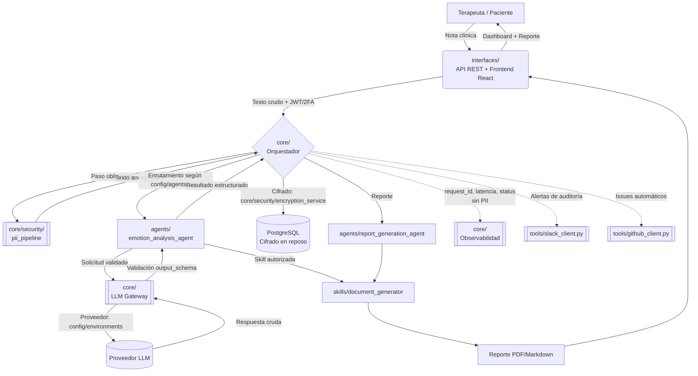

# Arquitectura del Sistema — MindFlow AI

**Framework:** `mi-framework-ia`
**Versión del documento:** 2.0.0
**Estado:** Vigente — reemplaza la versión 1.0.0 (alineada a la estructura `backend/app` + `frontend/src`)
**Audiencia:** Equipo de ingeniería (Electiva CPC Integración IA, UNIMINUTO Ibagué), auditores de seguridad

> **Nota de versión:** Esta versión documenta la migración oficial del proyecto hacia la estructura de repositorio `mi-framework-ia` (framework de agentes) definida por el docente de la Electiva. La versión 1.0.0 documentaba la arquitectura monolítica original (`backend/app` + `frontend/src`) construida en los prompts #01–#25. El mapeo detallado entre ambas estructuras está en el **Anexo de Migración** del documento maestro de prompts (`MindFlow_AI_Bateria_de_Prompts_EN.docx`).

---

## 1. Propósito y Alcance

MindFlow AI es un **copiloto de triaje y análisis emocional para terapeutas de salud mental**. El sistema no diagnostica ni prescribe: procesa notas clínicas anonimizadas, identifica señales emocionales y distorsiones cognitivas mediante un LLM, y devuelve resultados estructurados (dashboard + reporte) que el profesional tratante revisa antes de tomar cualquier decisión clínica.

**Alcance explícito del MVP:**

| SE DEMUESTRA | QUEDA FUERA |
|---|---|
| Carga/pegado de notas clínicas o transcripción anónima de consulta | Diagnóstico clínico automatizado o emisión de recetas médicas |
| Extracción en tiempo real de estados de ánimo y distorsiones cognitivas | Chat en vivo de interacción directa con el paciente o terapia presencial |
| Dashboard con gráfico de emociones, hallazgos clave y preguntas sugeridas | Integración con sistemas complejos de historias clínicas (EHR) |

Este documento describe la arquitectura basada en agentes de `mi-framework-ia`: sus capas, la infraestructura compartida y el flujo de datos extremo a extremo, con énfasis en el aislamiento de PII y el cumplimiento normativo de datos de salud.

---

## 2. Estructura del Repositorio

```text
mi-framework-ia/
├── agents/              # Definición de agentes especializados y lógica de ejecución
├── config/              # Configuraciones del framework
│   ├── environments/    # Variables de entorno y ajustes por ambiente (dev/test/prod)
│   ├── agents.yaml      # Manifiesto de configuración de agentes
│   └── skills.yaml      # Manifiesto de configuración de habilidades
├── core/                # Núcleo del framework: orquestador, memoria, LLM Gateway, seguridad
├── docs/                # architecture.md, manifest_schema.md
├── evaluations/         # Pruebas de rendimiento, precisión y casos de validación
├── interfaces/          # Capas de presentación y puntos de entrada (API / Frontend)
├── skills/              # Habilidades modulares atómicas
│   ├── code_executor/   # Ejecución segura de código (sandbox)
│   ├── db_query/        # Consultas estructuradas a la base de datos
│   ├── document_generator/ # Generación de reportes clínicos
│   └── web_search/      # Búsqueda y recuperación de información externa
├── tools/               # Utilidades externas e integraciones (automatización, no clínicas)
│   ├── github_client.py # Cliente para automatización y control de versiones
│   └── slack_client.py  # Cliente de notificaciones y alertas
├── .gitignore
├── Proyecto_MindFlow_AI.pdf
└── README.md
```

---

## 3. Principios de Diseño

| Principio | Aplicación en MindFlow AI |
|---|---|
| **Aislamiento de PII por defecto** | La anonimización vive en `core/` como middleware **no omitible**, no como una `skill` que un agente pudiera decidir saltarse. Ningún agente recibe texto clínico sin anonimizar. |
| **Soporte, no sustitución clínica** | Los `output_schema` de los agentes (`config/agents.yaml`) prohíben campos de diagnóstico o prescripción. |
| **Proveedor de LLM reemplazable** | Toda invocación a un modelo pasa por el LLM Gateway en `core/`; ningún agente ni skill llama directamente a un proveedor externo. |
| **Trazabilidad total** | Toda ejecución queda registrada en el bus de observabilidad de `core/` con `request_id`, sin persistir contenido clínico. |
| **Mínimo privilegio** | Cada agente y skill declara `permissions` explícitas en su manifiesto (`config/agents.yaml` / `config/skills.yaml`); el orquestador rechaza cualquier acción fuera de ese alcance. |
| **Separación framework / integraciones** | `tools/` (GitHub, Slack) es infraestructura de automatización del equipo de desarrollo — **nunca** tiene acceso a datos clínicos ni a PII. |

---

## 4. Capas del Sistema

### 4.1 Capa de Interfaces (`interfaces/`)

Punto de entrada humano y de sistemas externos hacia el framework. No contiene lógica de negocio ni acceso directo a datos clínicos sin cifrar.

- **Frontend clínico (React):** captura de notas clínicas (`NoteDropzone`), visualización del dashboard emocional (`EmotionRadarChart`, `DistortionCard`, `GuidingQuestions`) y exportación de reportes en PDF.
- **API REST (FastAPI):** expone autenticación (JWT + 2FA), ingestión de notas, disparo de análisis y consulta de reportes. Valida forma (Pydantic) y autenticación antes de delegar al Orquestador en `core/`.
- **Interfaz administrativa:** gestión de manifiestos de `config/`, revisión de auditoría y verificación de profesionales. Acceso restringido por rol.

**Responsabilidad exclusiva:** captura, validación de forma y presentación. La interfaz **no** decide qué agente ejecutar ni interpreta resultados clínicos.

### 4.2 Núcleo del Framework (`core/`)

Es el corazón de control de `mi-framework-ia`. Agrupa cuatro responsabilidades explícitamente asignadas por el docente a esta carpeta: **orquestador, gestión de memoria, LLM Gateway**, y —por decisión de diseño de este equipo— **seguridad transversal**.

1. **Orquestador**
   - Carga y valida `config/agents.yaml` y `config/skills.yaml` contra el esquema formal (`docs/manifest_schema.md`).
   - Enruta cada solicitud al agente correspondiente según su `role` declarado.
   - Ejecuta el ciclo plan → act → observe, invocando únicamente las skills listadas en `permissions.allowed_skills` del agente.
   - Aplica `timeout_seconds`, `max_retries` y `rate_limit` del manifiesto.
   - Clasifica y contiene fallos (`ProviderUnavailableError`, `StructuredOutputError`, `PermissionDeniedError`) sin propagar trazas internas hacia `interfaces/`.
2. **Gestión de memoria**
   - Memoria de sesión (corto plazo, TTL corto, sin PII persistida).
   - Memoria de análisis (largo plazo, PostgreSQL cifrado, indexada por `analysis_id`/`note_id`), con `ownership` validado antes de cualquier lectura.
3. **LLM Gateway**
   - Abstracción única (`analyze(text) -> AnalysisResponse`) independiente del proveedor, configurado por variable de entorno en `config/environments/`.
   - Aplica timeout, reintentos con backoff, rate limiting por agente y validación obligatoria de salida contra `output_schema`.
   - Rechaza cualquier payload que no incluya la marca `anonymized: true`.
4. **Seguridad transversal** *(decisión de diseño documentada — no explícita en el README original del docente, pero necesaria para la naturaleza clínica del proyecto)*
   - `core/security/pii_pipeline`: detección y anonimización de PII (Regex + NER), ejecutada como middleware obligatorio antes de enrutar cualquier texto a un agente.
   - `core/security/encryption_service`: cifrado AES-256-GCM en reposo para notas e historias clínicas.
   - Se modelan aquí —y no como `skill`— precisamente porque no deben ser opcionales ni saltables por un agente.

### 4.3 Capa de Agentes (`agents/`)

Cada agente es una unidad de razonamiento especializada, definida por un manifiesto en `config/agents.yaml`. Un agente no ejecuta código directamente: orquesta llamadas al LLM Gateway (`core/`) y a las skills que tiene autorizadas (`skills/`).

| Agente | Rol | Entrada | Salida |
|---|---|---|---|
| `triage_agent` | Prioriza y clasifica el nivel de atención sugerido a partir de la nota anonimizada. | Texto clínico anonimizado | Nivel de prioridad + justificación textual |
| `emotion_analysis_agent` | Extrae emociones, intensidad, evidencia textual y distorsiones cognitivas. | Texto clínico anonimizado | `AnalysisResponse` estructurado |
| `report_generation_agent` | Compone el reporte final en lenguaje profesional para el terapeuta. | `AnalysisResponse` + metadatos de sesión | Documento estructurado (vía `skills/document_generator`) |
| `audit_agent` | Agente de sistema (no expuesto al usuario final) que revisa consistencia entre manifiestos declarados y ejecuciones reales; puede notificar hallazgos vía `tools/slack_client.py`. | Logs de ejecución | Hallazgos de cumplimiento |

**Restricción de dominio:** el validador de manifiestos rechaza cualquier `output_schema` de agente que incluya campos como `diagnosis` o `prescription`.

### 4.4 Capa de Skills (`skills/`)

Las skills son funciones deterministas y auditables que un agente autorizado puede invocar. No razonan: ejecutan una capacidad concreta y devuelven un resultado validado contra `output_schema`.

- **`code_executor/`**: ejecución de código en sandbox aislado (sin red, sin acceso al filesystem del host); usado solo para transformaciones de datos no clínicos.
- **`db_query/`**: acceso de solo lectura/escritura controlada a la base de datos cifrada, siempre con `ownership` validado.
- **`document_generator/`**: composición de reportes PDF/Markdown a partir de datos ya estructurados y validados; nunca recibe texto clínico crudo.
- **`web_search/`**: búsqueda de referencias públicas (p. ej. líneas de atención en crisis); prohibida de recibir o transmitir PII.

### 4.5 Herramientas de Integración (`tools/`)

Utilidades externas de automatización del **equipo de desarrollo**, no del pipeline clínico:

- **`github_client.py`**: automatización de control de versiones (p. ej. el `audit_agent` puede abrir un issue automático ante un hallazgo `CRITICAL`).
- **`slack_client.py`**: notificaciones y alertas operativas (caídas del LLM Gateway, fallos de CI, hallazgos de auditoría).

**Restricción explícita:** ningún cliente de `tools/` puede recibir texto clínico, PII, ni resultados de `AnalysisResponse` con contenido identificable — únicamente metadata técnica (severidad, `request_id`, nombre de componente).

### 4.6 Configuración (`config/`)

- **`agents.yaml`** y **`skills.yaml`**: manifiestos formales (ver `manifest_schema.md`).
- **`environments/`**: variables y ajustes específicos por ambiente (`dev`, `test`, `prod`), incluyendo el proveedor de LLM activo, límites de rate limiting y flags de features — nunca secretos en texto plano dentro del repositorio.

### 4.7 Evaluaciones (`evaluations/`)

Casos de prueba de precisión y regresión para cada agente (referenciados desde `config/agents.yaml` vía `evaluation_suite`), y pruebas de rendimiento del LLM Gateway y de los pipelines de seguridad (PII, cifrado).

---

## 5. Diagrama de Flujo de Datos



**Puntos de control críticos:**

1. Ninguna nota clínica llega a un agente sin pasar por `core/security/pii_pipeline`.
2. Ninguna llamada al proveedor LLM ocurre fuera del LLM Gateway (`core/`).
3. Ninguna respuesta del LLM se persiste o se muestra sin validación contra `output_schema`.
4. `tools/` (GitHub, Slack) solo recibe metadata técnica, nunca datos clínicos.
5. Todo evento se traza con `request_id`, sin registrar contenido clínico.

---

## 6. Referencias Cruzadas

- Especificación de manifiestos: [`manifest_schema.md`](./manifest_schema.md)
- Definiciones activas: `config/agents.yaml`, `config/skills.yaml`, `config/environments/`
- Suite de evaluación: `evaluations/`
- Mapeo detallado de la arquitectura original (`backend/app` + `frontend/src`) hacia `mi-framework-ia`: Anexo de Migración en `MindFlow_AI_Bateria_de_Prompts_EN.docx`